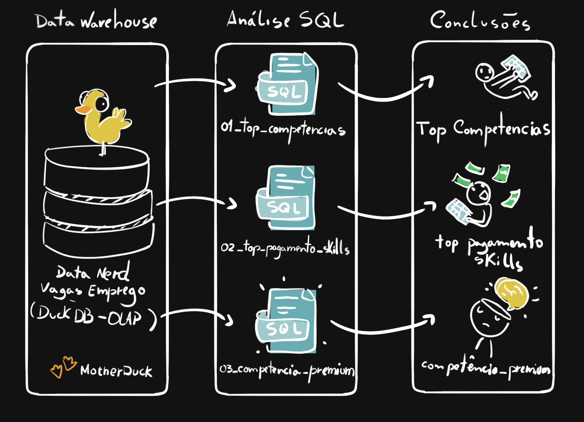

# 🔍 Análise de dados com SQL: Mercado de trabalho para Engenharia de Dados



Projeto SQL que analisa os dados do mercado na área de Engenharia de Dados usando MotherDuck/DuckDB. através do banco de dados montado através de 4 csv's extraídos diretamente do datanerd.tech com a devida autorização dos desenvolvedores.
Esse projeto demonstra minhas habilidades em  **escrever consultas SQL com qualidade de produção, eficientes e, principalmente, transformar perguntas de mercado em descobertas baseadas em dados**.

---

## 🧾 Resumo executivo

- ✅ **Escopo do Projeto:** Construir **3 consultas analíticas** que respondam a perguntas centrais sobre o mercado de Engenharia de Dados  
- ✅ **Modelagem de Dados:** Foi usado **JOINS entre várias tabelas** (tabela fato e tabelas dimensionais para extrair os dados desejados)  
- ✅ **Análise:** Aplicação de **agregações, filtragem e ordenação** para encontrar competências por demanda, salário e valor geral de mercado  
- ✅ **Conclusões:** Encontrei **conclusões relevantes** sobre a forte tendência de SQL/Python no mercado, uso de serviços de nuvem, e padrões salariais bem marcados

O banco de dados foi criado a partir desses 4 csv's com dados acumulados de janeiro de 2023 até 31/08/26

https://storage.googleapis.com/sql_de/bonus-80aee0e96046/job_postings_fact.csv

https://storage.googleapis.com/sql_de/bonus-80aee0e96046/skills_job_dim.csv

https://storage.googleapis.com/sql_de/bonus-80aee0e96046/skills_dim.csv

https://storage.googleapis.com/sql_de/bonus-80aee0e96046/company_dim.csv


Dados interessantes obtidos e as devidas consultas em SQL:

1. [`01_top_competencias.sql`](consultas/01_top_competencias.sql) – Análise com JOIN's feitos entre várias tabelas  
2. [`02_top_pagamento_skills.sql`](consultas/02_top_pagamento_skills.sql) – Análise de salários com agregação  
3. [`03_competencias_premium.sql`](consultas/03_premium_competencias.sql) – consulta mais otimizada combinando demanda/salário  

---

## 🧩 Problema e Contexto

Essa análise de mercado tenta responder:

- 🎯 **A maior demanda:** *Quais as competências mais requisitadas hoje para um engenheiro de dados?*  
- 💰 **As mais bem pagas:** *Quais competências são esperadas para os melhores salários?*  
- ⚖️ **O melhor equilíbrio:** *Quais competências agregam tanto demanda quanto os melhores salários?*  

Esse projeto analisa um **data warehouse** construído na arquitetura Star Schema. A estrutura consiste em:


- **Tabela Fact:** `job_postings_fact` - Tabela central contendo os anuncios de emprego (Nome da vaga, localização, salários, datas, etc.)
- **Tabelas Dimension:** 
  - `company_dim` - Informações das empresas linkadas às postagens das vagas
  - `skills_dim` - A catalogação das competências exigidas pelas vagas
- **Tabela Ponte:** `skills_job_dim` - O link "many-to-many" entre as vagas e as competências

Consultando essas tabelas interconectadas, extraí padrões salariais e habilidades altamente valorizadas para o cenário da engenharia de dados.  

---

## 🧰 Stack Utilizada

- 🐤 **Query Engine:** DuckDB para um OLAP rápido e consultas analíticas  
- 🧮 **Linguagem:** SQL (ANSI com funções analíticas)  
- 📊 **Arquitetura de Dados:** "Star schema": fact + dimension + tabela ponte  
- 🛠️ **Desenvolvimento:** VS Code pra edição SQL = + Linux Terminal para DuckDB CLI  
- 📦 **Controle de Versão:** Git/GitHub para os scripts versionados SQL  

---

## 📂 Estrutura desse repositório

```text
1_EDA/
├── 01_top_competencias.sql          # Consulta de análise de demanda
├── 02_top_pagamento_skills.sql      # Consulta de análise salarial
├── 03_premium_competencias.sql      # combinação demanda/melhores salários
└── README.md                        # você está aqui
```
---

## 🏗 Visão Geral da Análise

### Estrutura da Consulta

1. **[Top Competências](consultas/01_top_competencias.sql)** – Identifica as competêncoas top 10 para vagas remotas de engenharia de dados
2. **[Top pagamento skills](consultas/02_top_pagamento_skills.sql)** – Análise das top 25 competências mais bem pagas com métricas de salário e demanda
3. **[Competências Premium](consultas/03_premium_competencias.sql)** – Calculo a pontuação usando logarítimo natural para identificar as competências mais valorizadas de fato. Já que algumas, apesar de bem pagas, não possuiam tantas vagas no mercado

### Descobertas Centrais

- 🧠 Linguagens dominantes: SQL e Python aparecem de maneira muito acentuada. Fazendo delas as habilidades mais exigidas pelo mercado
- ☁️ Nuvem: AWS e Azure tem um papel crítico para a engenharia de dados 
- 🧱 Infraestrutura e ferramentas: Kubernetes, Docker e Terraform estão diretamente associados a salários premium
- 🔥 Ferramentas Big data: Apache Spark aparece com demanda forte e salários competitivos

---

## 💻 Competências SQL demonstradas

### Estruturação de Consulta e Otimização

- **JOIN's mais complexos**: `INNER JOIN` por tabelas múltiplas `job_postings_fact`, `skills_job_dim`, e `skills_dim`
- **Agregadores**: `COUNT()`, `MEDIAN()`, `ROUND()` para análise estatística
- **Filtros**: Lógica Boleana usando `WHERE` e múltiplas condições (`job_title_short`, `job_work_from_home`, `salary_year_avg IS NOT NULL`)
- **Ordenação e Limite**: `ORDER BY` com `DESC` e `LIMIT` para rankear os resultados

### Técnica para a análise dos dados

- **Agrupamento**: `GROUP BY` para uma análise categórica por competências exigidas pelo mercado
- **Funções Matemáticas**: `LN()` Para uma conversão ao logarítimo natural para normalizar as métricas do mercado
- **Métricas Calculadas**: Pontuação 'Premium' derivada combinando a demanda com transformação logarítima e mediana salarial
- **HAVING**: Para filtrar os resultados agregados (competências com postagens >= 100 )
- **NULL**: Deixei de fora todas as vagas que não informavam o salário (`salary_year_avg IS NOT NULL`)